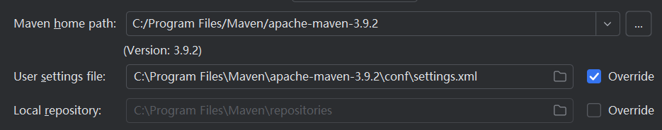

# SSM

## Structure

SpringMVC简化Controller层（表述层）逻辑，纳管与前端交互的逻辑，获取请求、调用业务、返回响应

Spring简化Service层（业务逻辑层）逻辑，纳管对象生命周期管理，调用DAO，处理参数，处理数据库

Mybatis简化DAO层（持久化层）逻辑，纳管数据库事务、CRUD

## Maven

> What Is Maven?
>
> Java项目构建（封装为war）、依赖管理（三方件管理）的工具
>
> Why Maven?
>
> 1. 构建过程公开，可切入任意构建节点（清理，编译，测试，报告，打包，部署）
> 2. maven跨IDE，不同的IDE提供不同的构建工具一般具有不同的项目结构，若均使用maven可以忽略这一层差异，可确保项目结构相同

### Precondition

Maven需要Java环境

### Directories

```txt
~
	-bin #maven执行二进制文件
	-boot #类加载器
	-conf #配置文件
		-seetings.xml
	-lib
```

### Alarm！

1. Maven3.9+需要使用https镜像节点，3.9-可以使用http镜像节点

2. 

    上图中，通过path手动指定要用的maven以代替IDEA集成的maven，其中user seetings file默认路径为user下的`.m2\settings.xml`，是maven默认全局配置文件的位置，可以更改其路径并重写配置文件来使用指定的配置文件，

    local repos路径已在settings.xml中给出，无需重写、更改

3. 更改maven，xml配置文件之后需要执行reload刷新配置

4. 为了规避用户短期频繁操作可能导致的多重下载，maven在拉取jar之前会创建与jar同名的.lastupdated文件，若此文件存在，相关jar不会重复执行下载命令。若前次网络波动导致下载失败，删除相应的.lastupdated文件可能会解决问题

5. 在遭遇可能的缓存问题时，重启IDEA或清空缓存（Files > Invalidate Caches）

### Attributes

GAVP，用于在maven仓库中区分各种maven工程，同时概括了maven项目的重要属性

G：GroupId，组织、公司标识，似包名，公司、组织域名倒置

A：ArtifactId，项目名称

V：Version，推荐使用主版本.次版本.修订号

P：Packaging，打包方式，也标识是何种工程，jar（默认）为JavaSE工程，war为JavaWeb工程，pom为父工程，逻辑标识，不打包。


S：Scope，可选的属性，默认为compile，详细解释参考下表：

请谨慎使用Scope属性

|          | main（指工程中main路径） | test（指工程中test路径) | packaged（路径） | Eg.            |
| -------- | ------------------------ | ----------------------- | ---------------- | -------------- |
| compile  | accessible               | accessible              | accessible       | Druid          |
| provided | accessible               | accessible              | UNACCESSIBLE     | Servlet/Tomcat |
| runtime  | UNACCESSIBLE             | UNACCESSIBLE            | accessible       | JDBC           |
| test     | UNACCESSIBLE             | accessible              | UNACCESSIBLE     | JUnit          |

### Dependecies

maven仓库信息官网 https://mvnrepository.com/

在xml中，通过在`<dependencies></dependencies>`标签组中，以`<dependency></dependency>`标签组添加所需jar的GAV属性来获取jar

#### Passing

> 运用依赖传递，简化相关配置编写的同时，将大量依赖间的版本匹配交由maven纳管，减少可能错误的发生

传递导入：导入单个依赖时，会延依赖树自动导入树上的全部依赖，若在此过程中遭遇终止条件，则停止传递过程

Eg.

使用jackson需要同时导入core、databind、annotations三个依赖项，但databind **Compile依赖**于core以及annotations，因此依照传递过程，将只需要导入databind，

在databind导入后，maven将自动导入相关的core、annotations

databind同时以**Test依赖**于JUnit、guava等，但由于**非Compile依赖**，**传递在此终止，非Compile依赖不会被导入**

core 以**Test依赖**于JUnit，但由于非Compile依赖，**传递在此终止，JUnit不会被导入**

#### Termination

1. 若下一个依赖的作用域不为Compile，传递终止
2. 若下一个依赖发生冲突时，传递终止

#### Conflicts

依赖链上存在相同的jar包，就会产生冲突

当发生冲突时候，maven首先比对两条依赖链，保留短的，终止长的、若长度相同，则按照声明顺序保留

1. 短路优先原则（第一原则）

A—>B—>C—>D—>E—>X(version 0.0.1)

A—>F—>X(version 0.0.2)

则A依赖于X(version 0.0.2)。

2. 依赖路径长度相同情况下，则“先声明优先”（第二原则）

A—>E—>X(version 0.0.1)

A—>F—>X(version 0.0.2)

在`\<dependencies>\</dependencies>`中，先声明的，路径相同，则优先选择

使用如下结构手动排除一个依赖以避免冲突

```xml
<exclusions>
	<exclusion>
    	<groupId></groupId>
        <artifactId></artifactId>
    </exclusion>
</exclusions>
```

### Build

1. 使用如下结构指定maven要使用的插件版本，`</build>`是与`</dependencies>`同级的标签，maven插件版本不匹配可能会导致构建问题

```xml
<build>
	<plugins>
    	<groupId>{name}</groupId>
        <artifactId>{name}</artifactId>
        <version>{version}</version>
    </plugins>
</build>
```

2. maven工程有标准的结构，特定的目录用于存储特定的文件类型，如果违反了默认原则， 则违规的文件不会被打包

#### Building Cycle

1. Clean 清理，清空target目录下的生成资源，含有字节码、打好的包等
    1. 调用maven-clean-plugin
2. Compile 编译，编译为字节码，封装资源
    1. 调用maven-resources-plugin
    2. 调用maven-compiler-plugin
3. Test 测试，执行单元测试
    1. 调用Compile周期
    2. 调用maven-testResources-plugin
    3. 调用maven-surefire-plugin
4. Site 报告，给出项目报告
    1. 仅调用maven-site-plugin
5. Package 打包，完成构建，交付输出件，war、jar等
    1. 调用Test周期
    2. 调用maven-war-plugin或其他打包插件
6. Install / Deploy 部署，将交付的jar部署到本地/远程仓库
    1. 调用Package周期
    2. 调用maven-install-plugin或其他打包插件

将war自动部署至容器（Tomcat等）并非maven的工作

较为常用的周期为Clean周期、Package周期、Install周期

通过下述方式调用

```cmd
mvn clean
mvn clean package
mvn clean install
```

#### Building Configs

在`<\build>`中使用如下结构设定部分构建属性

`finalName`属性将指定构建后的输出件名，默认值为`{artifactId}-{version}.{packaging}`

```xml
<finalName>{name}</finalName>
```

使用`<\resources>`结合`<\resource>`标签，要求maven将违规文件打包

属性字符串中，\*\*表示全部目录，\*.\*表示全部文件名、全部扩展名

```xml
<resources>
    <resource>
        <directory>src/main/java</directory>
        <includes>
            <include>**/*.*</include>
        </includes>
        <excludes>
            <exclude>**/*.java</exclude>
        </excludes>
    </resource>
</resources>
```

### Moudle Extends

在父工程中统一管辖子工程的依赖版本，通过pom管理继承

一个标准的父工程只作为逻辑工程存在，不具备src文件

父工程中以`</dependencies>`声明的依赖将被全部子工程继承，并导入

父工程中以`</dependencyManagement>`声明的依赖将被全部子工程继承，并由子工程自行决定是否导入，且在导入时不需要指定版本号（在未指定版本号的时候，将直接使用父工程中的版本），`</dependencyManagment>`内部结构与`</dependencies>`一致

#### Moudles Aggregation

在父工程中使用`</modules>`下的`</module>`配置模块，可以通过父工程统一执行构建流程，梳理子工程间的依赖关系，批量处理

### Maven Repos

Local Repo， 本地仓库，优先级最高，若有直接返回

Remote Repo，远程仓库，配置镜像源、公司私服等，访问速度更快

Maven Central Repo，中央仓库，访问速度满，默认配置

## Framework

单一架构可以分为表述层（Controller）、业务逻辑层（Service）、持久化层（DAO），在过去，使用SSH、SSH2分别对应各层次

Spring主体简化业务逻辑，但是贯穿三层始终

|      | 表述      | 业务逻辑 | 持久化    |
| ---- | --------- | -------- | --------- |
| SSH  | Struts    | Spring   | Hibernate |
| SSH2 | Struts2   | Spring   | Hibernate |
| SSM  | SpringMVC | Spring   | Mybatis   |

SpringBoot用于快速启动服务，同时缩减手动配置项

SpringCloud用于编排大量服务，串联服务间通信

Docker用于快速安装中间件

> What Is FrameWork?
>
> 集成基本结构、规范、设计模式、编程语言、程序库等基础组件的软件系统。
>
> 使用框架可以实现降本增效：预设大量组件、工具；提供标准、归一化的开发环境；历经时间考验的深度优化系统，稳定性更高
>
> 框架具备较高的学习成本，想要娴熟驾驭此工具，需要对底层原理有深刻理解。

### Attributes

支撑性、扩展性：框架提供基本功能，业务需要自行代码实现

聚合性、约束性：框架高度整合了一类技术栈，使用时必然受到约束

### Spring & SpringFramework

#### Tips Before All

1. JUnit5+可以兼容Spring的测试环境，同时，JUnit5相比JUnit4增加了诸多注解，可以统一进行其他操作
2. 若没有成功添加Spring的依赖，使用IDEA时，无法新建Spring Config Xml文件
3. 命名测试类使用xxxTest格式，便于maven Test执行，非此格式的测试类不会被maven Test触发

Spring代表Spring相关的一套技术栈，SpringFramework是该系列的基石，通常，SpringFramework可以简称为Spring

SpringFramework的核心功能：

1. IoC / DI
2. AOP
3. TX

#### IoC / DI

IoC、DI均发生在核心容器中

SpringFramework最为核心的功能即为对象管理，也可以称为组件管理，在SpringFramework中，组件是可重复使用的对象，也正因此，组件的核心问题和对象的核心问题一致：存储在哪里？以及生命周期管理。

SpringFramework使用Spring核心容器解决组件的两个核心问题。

SpringFramework中的容器接口：

`BeanFactory`定义了IoC容器的顶层接口，定义IoC容器的基本特征，含有`getBean`等操作组件的基本方法，`ApplicationContext`继承于`BeanFactory`，扩展了组件管理、消息资源处理、AOP集成部分，易于企业开发使用

常用的实体容器均继承于`ApplicationContext`，它们与组件相关的方法均重写自`ApplicationContext`：

| Class Name                         | Desc                                                         |
| ---------------------------------- | ------------------------------------------------------------ |
| ClassPathXmlApplicationContext     | 读取类路径下xml文件创建实体的容器，所谓类路径，指target中classes下的配置文件 |
| FileSystemXmlApplicationContext    | 读取系统文件路径下xml文件创建实体的容器                      |
| AnnotationConfigApplicationContext | 读取Java注解配置创建实体的容器                               |
| WebApplicationContext              | 专为Web应用准备，在Web环境中创建实体并将实体引入ServletContext中的容器 |

配置容器的三种方式：

1. Xml：伊始的配置方式
2. Annotation：基于注解的配置方式，缩减大量的Xml编写
3. Config Class：基于配置类的配置方式，大量应用于SpringBoot

所谓IoC，Inversion of Control，即为使用核心容器纳管组件的生命周期、存储，只需人工描述配置文件即可

所谓DI，Dependency Injection，即为使用核心容器纳管组件的交互，举例：组件A聚合了组件B，此时聚合动作由核心容器完成

##### xml

使用核心容器纳管组件只有三个步骤：

1. 编写元文件，使用元文件描述对象的各种特征
2. 创建相应的核心容器，读取元文件，核心容器将托管对象
3. 调用核心容器的接口，获取需要的组件

